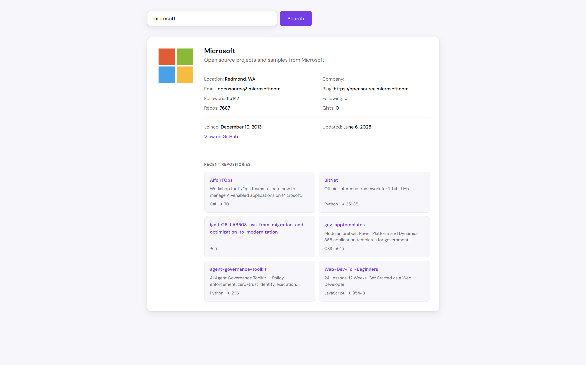

<div align="center">

# GitHub Profile Viewer

A simple GitHub profile viewer built with React and TypeScript.

Search any GitHub username and see their profile info pulled from the GitHub public API.



</div>

## Stack

* React + TypeScript
* Vite
* GitHub REST API

## Running Locally

```bash
npm install
npm run dev
```

## License

MIT