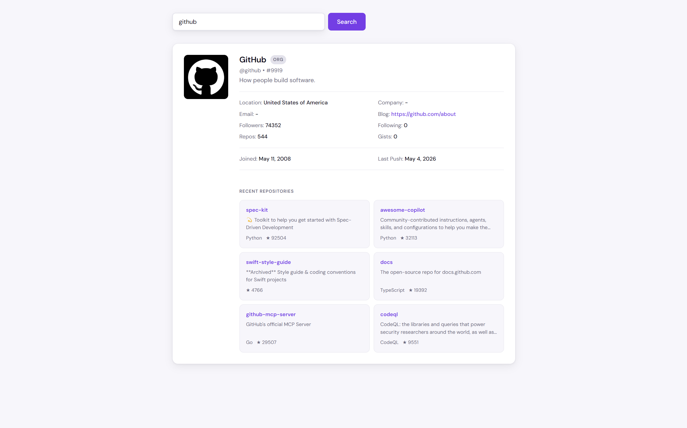
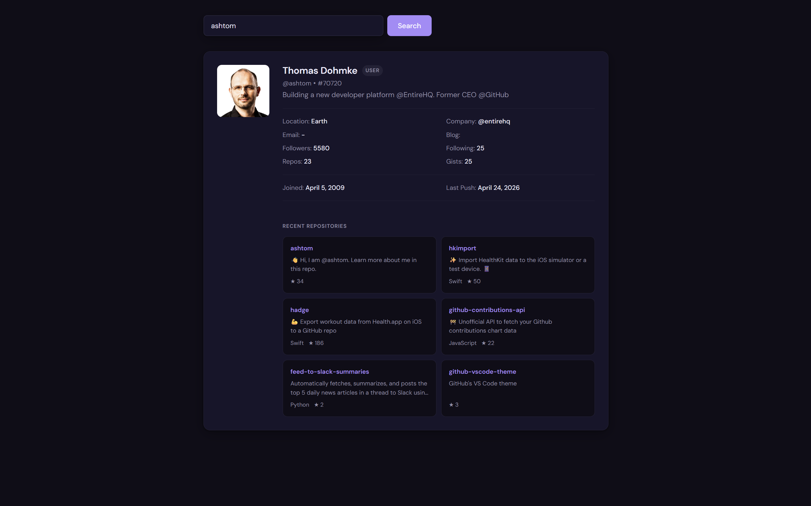

<div align="center">


# GitHub Profile Viewer

Search and view GitHub profiles through a streamlined interface.

[](./LICENSE)


</div>

## ✨ Features

- Search up any GitHub user or organization
- View their information quickly through a clean interface

## 📦 Built With

| Tool | Purpose |
| - | - |
| GitHub REST API | Access profile information |

## 📸 Preview

<div style="display: flex; gap: 10px; justify-content: center">
    
    
</div>

## 🚀 Installation

The easiest way to access is going to the website: [https://github-profile-viewer-theta-ten.vercel.app/](https://github-profile-viewer-theta-ten.vercel.app/).

Or, if you wish to use it locally, here are the steps:

> Note: The API token is server-side and only runs on Vercel, or locally via `vercel dev`. Running `npm run dev` will not work.

### Prerequisites

- [GitHub Personal Access Token](https://github.com/settings/tokens)
- [Vercel CLI](https://vercel.com/docs/cli) (`npm i -g vercel`)

Rename `.env.example` to `.env` and fill in your tokens. `GITHUB_TOKEN_BACKUP` is optional and only used as a fallback.

### 1. Downloading the Code

Clone the repository through a terminal, such as Command Line or Powershell:

```
git clone https://github.com/johnarp/github-profile-viewer
cd github-profile-viewer
npm install
```

### 2. Run the Application

Through a terminal, navigate to the directory and use this command to run the app on your local network:

```
vercel dev
```

Then open the IP address given in a browser.

## 🗺️ Roadmap

- "View All" for repositories and organizations
- Improve spacing of second headings
- Website icon
- Make user IDs copyable
- List of repos a user has starred
- Events / activity feed
- Commit history
- Separate GitHub Repository Viewer
- "View All" for repos and orgs

## 📜 Disclaimer

This project uses a shared GitHub Personal Access Token. While the rate limit is relatively high, please avoid spammy or automated usage to prevent hitting it.

## 📄 License

This project is licensed under the [MIT License](./LICENSE).

## ⚖️ Legal

GitHub Profile Viewer is an unofficial project and is not affiliated with, endorsed by, or associated with Github Inc. or Microsoft Corporation in any way. The project uses GitHub's publicly available REST API.

"GitHub" is a trademark of Microsoft Corporation.